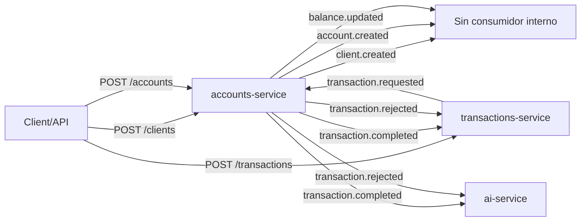
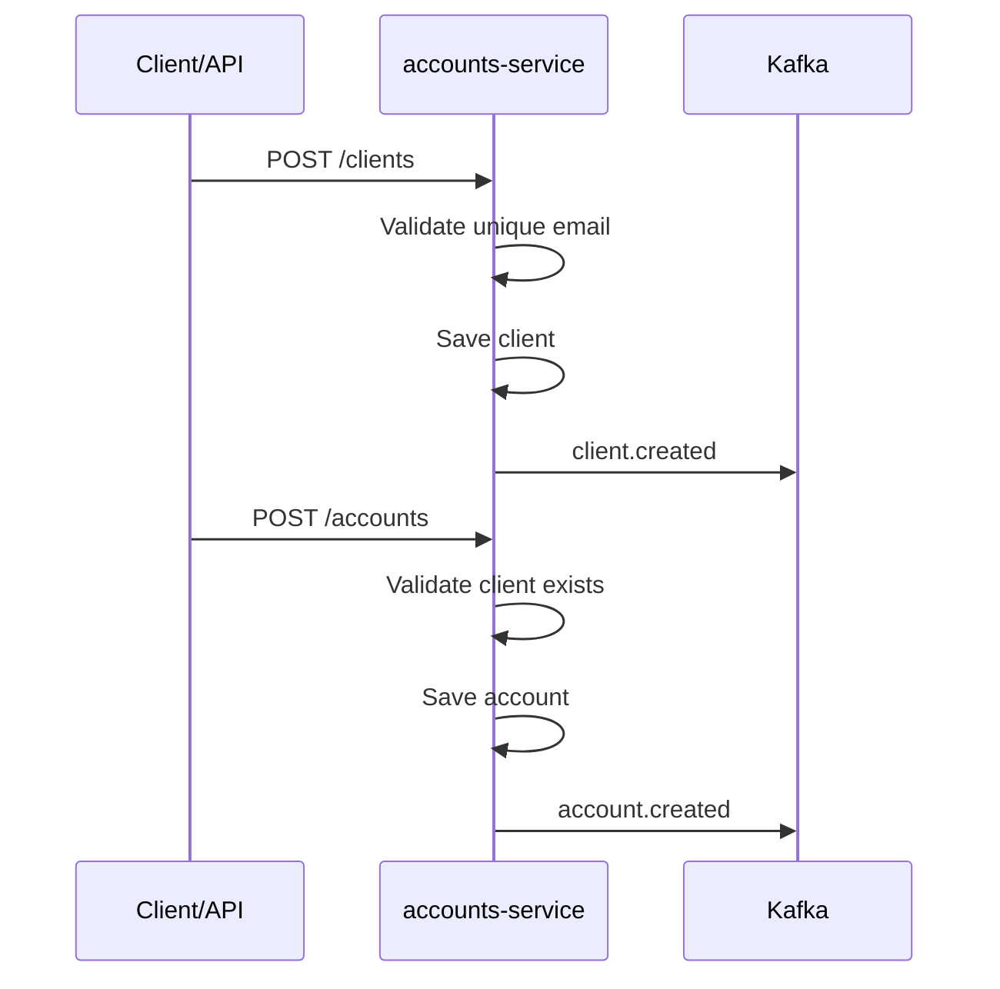
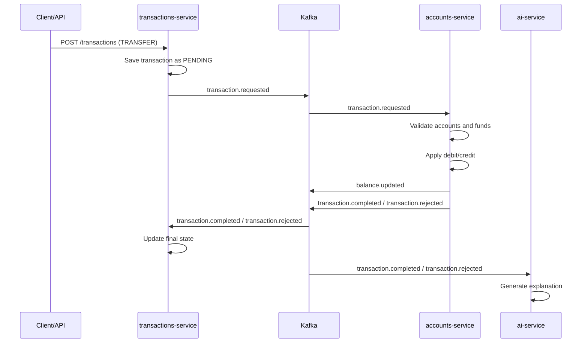
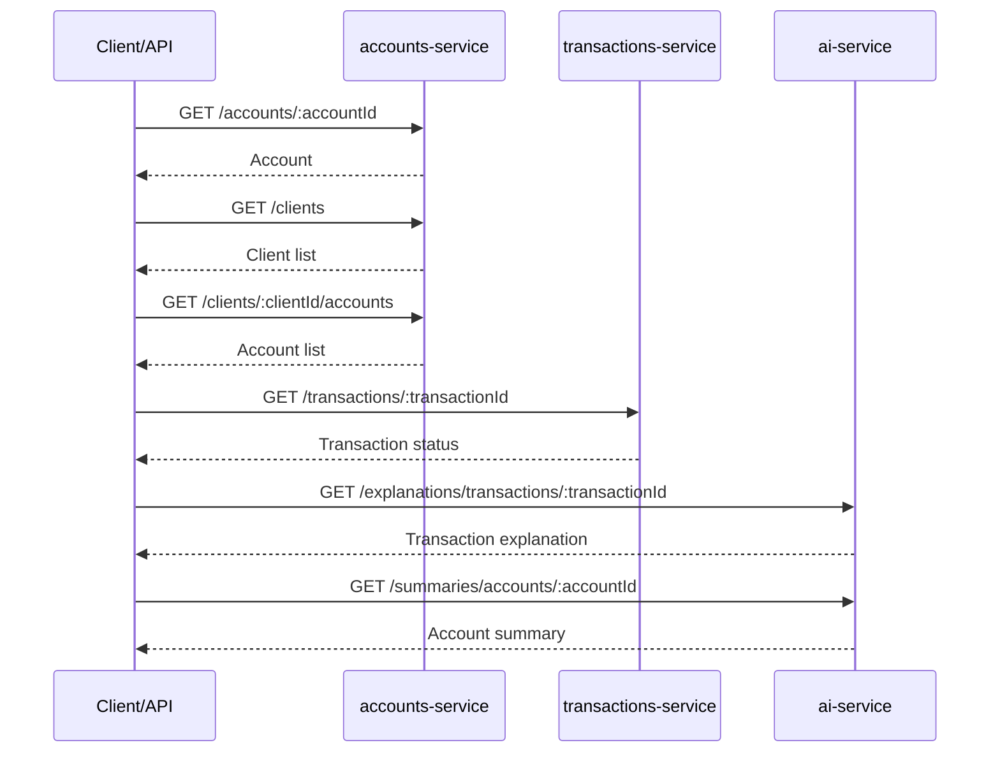

# Arkano Bank Platform

Solución del reto técnico de Arkano implementada como monorepo NestJS con tres microservicios, Kafka y bases de datos PostgreSQL independientes.

## Arquitectura general

- `accounts-service`: gestiona clientes, cuentas y el saldo de cada cuenta.
- `transactions-service`: registra solicitudes de depósito, retiro y transferencia, y mantiene el estado de la transacción.
- `ai-service`: consume eventos técnicos y genera explicaciones/summaries en lenguaje natural mediante un proveedor LLM mock.
- `Kafka`: bus de eventos obligatorio para coordinar el flujo asíncrono.
- `PostgreSQL`: una base dedicada por microservicio.

La solución usa una clean architecture ligera:

- `domain`: reglas y errores de negocio.
- `application`: casos de uso y servicios.
- `infrastructure`: HTTP, Kafka, persistencia y proveedor LLM.

## Bus de servicios utilizado

- Broker: Kafka en modo KRaft.
- Tópicos:
  - `client.created`
  - `account.created`
  - `balance.updated`
  - `transaction.requested`
  - `transaction.completed`
  - `transaction.rejected`

Todos los eventos comparten metadata:

- `eventId`
- `eventType`
- `occurredAt`
- `correlationId`

## Mapa de eventos Kafka



## Flujo de alta de cliente y cuenta



## Flujo de una transferencia

1. `transactions-service` recibe `POST /transactions` con `type=TRANSFER`.
2. Guarda la transacción en estado `PENDING`.
3. Publica `transaction.requested`.
4. `accounts-service` consume el evento, valida cuentas y fondos, y aplica el movimiento dentro de una transacción local de base de datos.
5. `accounts-service` publica `balance.updated` para las cuentas afectadas.
6. `accounts-service` publica `transaction.completed` o `transaction.rejected`.
7. `transactions-service` consume ese resultado y actualiza el estado final.
8. `ai-service` consume el resultado y genera una explicación legible para usuario final.

Nota: `balance.updated` queda publicado en Kafka para auditoría, reporting o futuras integraciones. En la implementación actual del monorepo no hay ningún consumidor interno suscrito a ese tópico.



## Rol del microservicio LLM

`ai-service` no ejecuta lógica bancaria. Solo interpreta eventos ya resueltos y expone:

- `GET /explanations/transactions/:transactionId`
- `GET /summaries/accounts/:accountId`

Por defecto usa `MockLlmProvider`, con una interfaz (`LlmPort`) lista para conectar OpenAI u otro proveedor real sin tocar la lógica de aplicación.

## Flujos de consulta HTTP



## Endpoints HTTP

### accounts-service

- `POST /clients`
- `GET /clients`
- `POST /accounts`
- `GET /accounts/:accountId`
- `GET /clients/:clientId/accounts`

### transactions-service

- `POST /transactions`
- `GET /transactions/:transactionId`

### ai-service

- `GET /explanations/transactions/:transactionId`
- `GET /summaries/accounts/:accountId`

## Decisiones técnicas clave

- NestJS para los tres servicios.
- PostgreSQL independiente por servicio.
- TypeORM con migraciones ejecutadas al arrancar.
- Kafka event-driven obligatorio.
- Idempotencia:
  - `transactions-service` usa `idempotencyKey` único.
  - consumidores críticos usan tabla `processed_events`.
- Manejo básico de fallos:
  - errores de negocio publican `transaction.rejected`
  - errores técnicos en consumidores se propagan para permitir reintento del broker

## Ejecutar con Docker

Prerequisito: Docker Desktop o Docker Engine levantado.

Modo productivo local, recompilando las imágenes:

```bash
docker compose up --build
```

Modo desarrollo, con el código local montado en los contenedores y reinicio automático al cambiar archivos `.ts`:

```bash
docker compose -f docker-compose.yml -f docker-compose.dev.yml up --build
```

Después del primer build en modo desarrollo, los cambios de código deberían tomarse al guardar sin reconstruir la imagen. Si cambias dependencias en `package.json`, vuelve a ejecutar el comando con `--build`.

Servicios expuestos:

- `accounts-service`: `http://localhost:3001`
- `transactions-service`: `http://localhost:3002`
- `ai-service`: `http://localhost:3003`
- Kafka: `localhost:9092`

Swagger:

- `accounts-service`: `http://localhost:3001/docs`
- `transactions-service`: `http://localhost:3002/docs`
- `ai-service`: `http://localhost:3003/docs`

Bases de datos:

- `accounts-db`: `localhost:5433`
- `transactions-db`: `localhost:5434`
- `ai-db`: `localhost:5435`

Para detener y limpiar:

```bash
docker compose down -v
```

## Pruebas

```bash
npm run build
npm test
```

Se incluyen:

- unit tests para reglas críticas e idempotencia
- e2e tests ligeros para contratos HTTP

## Ejemplos de uso

Crear cliente:

```bash
curl -X POST http://localhost:3001/clients \
  -H "Content-Type: application/json" \
  -d '{"name":"Ada Lovelace","email":"ada@example.com"}'
```

Crear cuenta:

```bash
curl -X POST http://localhost:3001/accounts \
  -H "Content-Type: application/json" \
  -d '{"clientId":"<client-id>","currency":"USD","initialBalance":150}'
```

Solicitar transferencia:

```bash
curl -X POST http://localhost:3002/transactions \
  -H "Content-Type: application/json" \
  -d '{"type":"TRANSFER","amount":40,"sourceAccountId":"<source-account-id>","targetAccountId":"<target-account-id>","idempotencyKey":"transfer-001"}'
```

Consultar explicación:

```bash
curl http://localhost:3003/explanations/transactions/<transaction-id>
```
